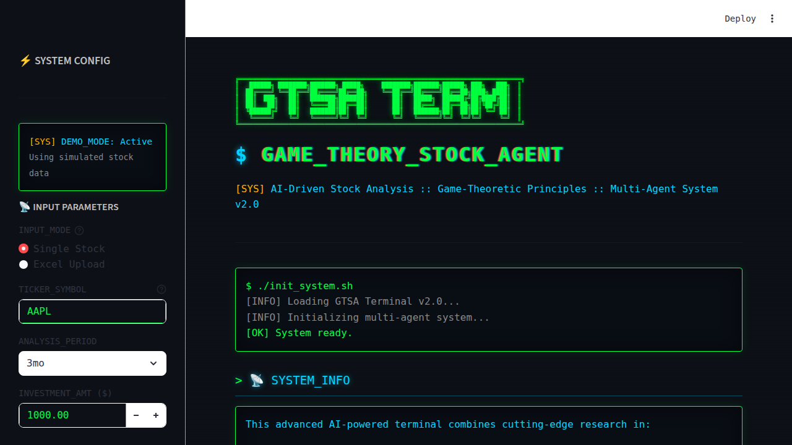
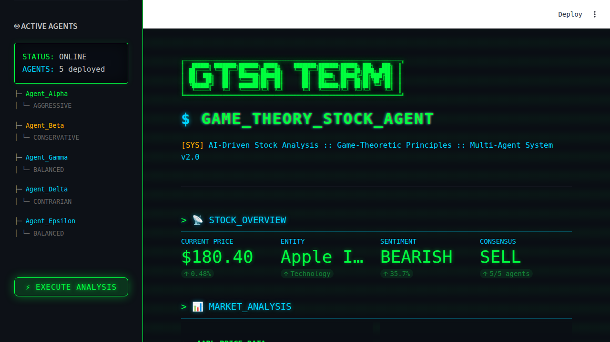
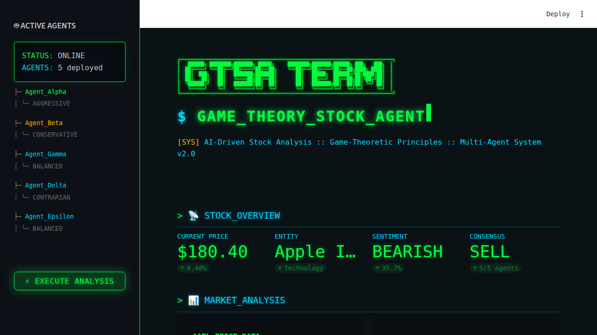

# 📸 UI Showcase - Game Theory Stock Agent Dashboard

This document showcases the user interface of the Game Theory Stock Agent (GTSA) Terminal, a Streamlit-based dashboard for AI-driven stock analysis.

## 🎨 Design Philosophy

The GTSA Terminal features a **terminal-style cyberpunk aesthetic** with:
- Dark background (#0a0e14) with scan-line effects
- Green (#00ff41) and cyan (#00d4ff) accent colors
- JetBrains Mono monospace font throughout
- Terminal-style command prompts and ASCII art
- Glowing text effects and borders

---

## 📱 Application Views

### 1. Landing Page / Initial State

**Key Features:**
- **Left Sidebar (System Config)**
  - Demo mode indicator
  - Input parameters section:
    - Input mode selection (Single Stock / Excel Upload)
    - Ticker symbol input (e.g., AAPL, GOOGL)
    - Analysis period dropdown (1mo, 3mo, 6mo, 1y)
    - Investment amount slider ($100 - $10,000)
  - Active agents display showing all 5 AI agents:
    - Agent_Alpha (Aggressive)
    - Agent_Beta (Conservative)
    - Agent_Gamma (Balanced)
    - Agent_Delta (Contrarian)
    - Agent_Epsilon (Balanced)
  - Execute Analysis button

- **Main Content Area**
  - ASCII art header "GTSA TERM"
  - System initialization messages
  - System information section explaining the technology
  - Usage instructions
  - Quick start examples with popular tickers by sector
  - Terminal prompt styling throughout

**User Journey:** This is the first page users see. They can enter a stock ticker, configure analysis parameters, and click "Execute Analysis" to start.

---

### 2. Single Stock Analysis - Complete View

**Key Sections:**

#### A. Stock Overview (Metrics Bar)
Four key metrics displayed in a row:
- **Current Price**: Stock price with daily change percentage
- **Entity**: Company name and sector
- **Sentiment**: Market sentiment (Bullish/Bearish/Neutral) with percentage
- **Consensus**: Agent consensus decision with vote count

#### B. Market Analysis
- **Price Chart**: Interactive Plotly chart showing:
  - Price data over selected period
  - MA20 (20-day moving average)
  - MA50 (50-day moving average)
  - Terminal-style green color scheme
  
- **Sentiment Gauge**: 
  - Visual gauge showing composite sentiment score
  - Sentiment components breakdown:
    - Text sentiment (from news analysis)
    - Momentum (from price trends)
    - Volume (from trading volume analysis)

#### C. Agent Matrix / Game Theory
- **Agent Decision Chart**: Bar chart showing agent vote distribution (BUY/SELL/HOLD)
- **Individual Agent Cards**: Each agent displayed with:
  - Agent name and strategy type
  - Recommended action
  - Confidence percentage
  - Allocation percentage
  
- **Nash Equilibrium Visualization**: Bar chart showing equilibrium ratios
- **Nash Metrics**:
  - Stability score
  - Equilibrium status
  - Action distribution breakdown

#### D. Investment Recommendation
- Recommended action (BUY/SELL/HOLD)
- Allocation amount (based on investment parameter)
- Confidence level
- Days until next investment
- Agent votes summary

#### E. News Feed
- Simulated news headlines (in demo mode)
- Terminal-style bullet points

#### F. Expandable Sections (Collapsible)
- 📊 Technical Indicators
- 🎮 Game Theory Insights

**User Journey:** After clicking "Execute Analysis", users see comprehensive stock analysis with charts, agent decisions, and recommendations.

---

### 3. Market Analysis Charts - Detailed View

This screenshot provides a closer view of the **Market Analysis** section, highlighting:

**Left Column - Price Chart:**
- Time series visualization with date range on X-axis
- Price in USD on Y-axis
- Three overlaid lines:
  - Blue: Current price
  - Orange: 20-day moving average
  - Red: 50-day moving average
- Interactive toolbar for zoom, pan, download
- Terminal-style title: ">> AAPL PRICE_DATA"

**Right Column - Sentiment Analysis:**
- **Sentiment Gauge**:
  - Arc-style gauge displaying current sentiment percentage
  - Color-coded (green for bullish, red for bearish)
  - Shows delta from neutral (50%)
  
- **Sentiment Components**:
  - Three horizontal progress bars showing:
    - TEXT: Sentiment from news analysis (NLP)
    - MOMENTUM: Sentiment from price trends
    - VOLUME: Sentiment from trading volume
  - Each component shows percentage value

**User Journey:** Users can analyze technical indicators and sentiment breakdown to understand the basis for AI agent recommendations.

---

## 💼 Portfolio Mode (Excel Upload)

While not captured in these screenshots, the application also supports:

- **Excel file upload** for batch analysis of multiple stocks
- **Portfolio breakdown** charts showing:
  - Action distribution (BUY/SELL/HOLD count)
  - Sector distribution
- **Stock details table** with all analyzed stocks
- **Allocation summary** showing total investment distribution

**How to use:**
1. Select "Excel Upload" radio button in sidebar
2. Upload .xlsx file with ticker symbols
3. Click "Execute Analysis"
4. View portfolio-level insights and per-stock breakdown

---

## 🎯 Key UI/UX Features

### Terminal Aesthetics
- **Glowing effects**: Text shadows on headers and key elements
- **Scan lines**: Subtle horizontal lines giving CRT monitor effect
- **Terminal prompts**: `$` and `>` symbols throughout
- **ASCII borders**: Box-drawing characters for visual separation
- **Monospace fonts**: JetBrains Mono for terminal feel

### Interactive Elements
- **Plotly charts**: Fully interactive with zoom, pan, download capabilities
- **Progress bars**: For sentiment component visualization
- **Expandable sections**: Collapsible details for advanced users
- **Radio buttons & inputs**: Terminal-styled form elements
- **Buttons**: Outlined style with hover glow effects

### Color Coding
- **Green (#00ff41)**: Bullish signals, positive actions, system ready
- **Cyan (#00d4ff)**: Headers, labels, agent names
- **Red (#ff3e3e)**: Bearish signals, sell actions
- **Orange (#ffb000)**: Neutral signals, hold actions, warnings
- **Gray (#888)**: Secondary text, metadata

### Responsive Design
- Two-column layouts for charts and metrics
- Four-column metric cards for key indicators
- Sidebar collapses for more screen space
- Full-page screenshots enabled for documentation

---

## 🚀 User Workflows

### Workflow 1: Single Stock Analysis
1. **Land** on homepage
2. **Enter** ticker symbol (e.g., "AAPL")
3. **Configure** analysis period and investment amount
4. **Click** "Execute Analysis"
5. **Review** stock overview metrics
6. **Analyze** price charts and sentiment
7. **Read** agent decisions and game theory analysis
8. **Follow** investment recommendation

### Workflow 2: Portfolio Analysis
1. **Land** on homepage
2. **Select** "Excel Upload" mode
3. **Upload** .xlsx file with tickers
4. **Click** "Execute Analysis"
5. **Review** portfolio overview metrics
6. **Examine** sector and action distribution charts
7. **Browse** detailed stock table
8. **Review** allocation summary

### Workflow 3: Deep Dive Analysis
1. **Start** with single stock analysis
2. **Expand** "Technical Indicators" section
3. **Review** RSI, volatility, volume metrics
4. **Expand** "Game Theory Insights" section
5. **Read** about agent strategies and payoff functions
6. **Download** charts for external analysis
7. **Adjust** parameters and re-run analysis

---

## 📊 Chart Types Used

1. **Line Charts**: Price data with moving averages
2. **Bar Charts**: Agent decisions, Nash equilibrium ratios, sector distribution
3. **Gauge Charts**: Market sentiment visualization
4. **Progress Bars**: Sentiment component breakdown
5. **Data Tables**: Stock details in portfolio mode

---

## 🎨 Visual Hierarchy

The UI follows a clear visual hierarchy:

1. **Primary**: ASCII header, main metrics, recommended action
2. **Secondary**: Charts, agent cards, Nash equilibrium
3. **Tertiary**: Sentiment components, technical indicators (expandable)
4. **Metadata**: Agent strategies, timestamps, system messages

---

## 🔧 Technical Implementation

- **Framework**: Streamlit
- **Charting**: Plotly (interactive charts)
- **Styling**: Custom CSS with terminal theme
- **Fonts**: JetBrains Mono (via Google Fonts)
- **Icons**: Emoji for section markers
- **Layout**: Streamlit columns and containers

---

## 📝 Notes for Developers

- Screenshots are stored in `/docs/screenshots/`
- All screenshots use full-page capture for complete view
- Screenshots show demo mode (simulated data)
- Terminal styling is defined in main `app.py` custom CSS
- Color scheme can be modified in CSS variables section

---

## 🆕 Future UI Enhancements

Potential improvements to consider:

- **Dark/Light mode toggle**
- **Customizable color themes**
- **Export to PDF** functionality
- **Historical analysis comparison** slider
- **Real-time updates** with WebSocket
- **Mobile-optimized** responsive layouts
- **Tutorial overlay** for first-time users
- **Saved preferences** with session state

---

*Last Updated: January 29, 2026*  
*UI Version: 2.0 (GTSA Terminal)*
